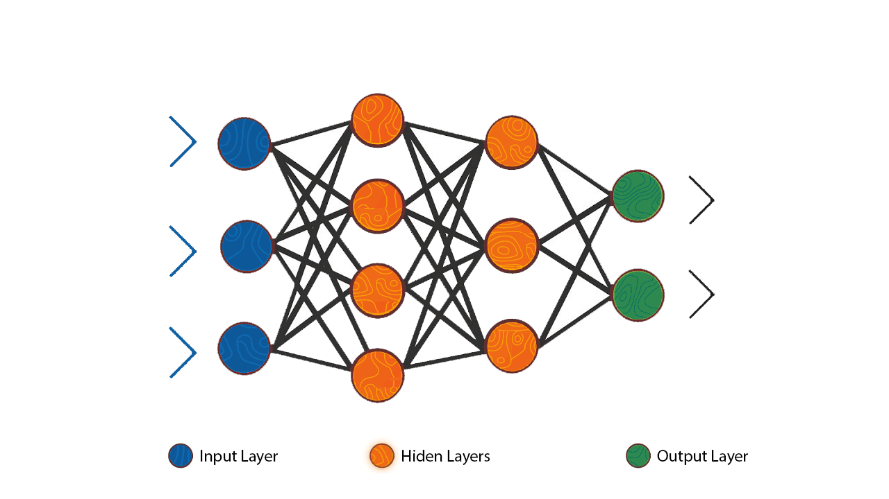
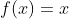
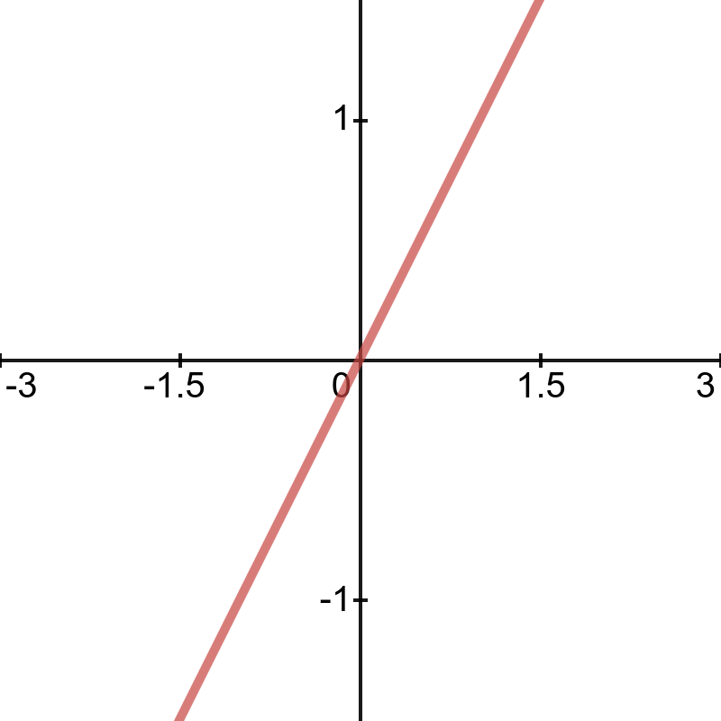
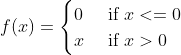
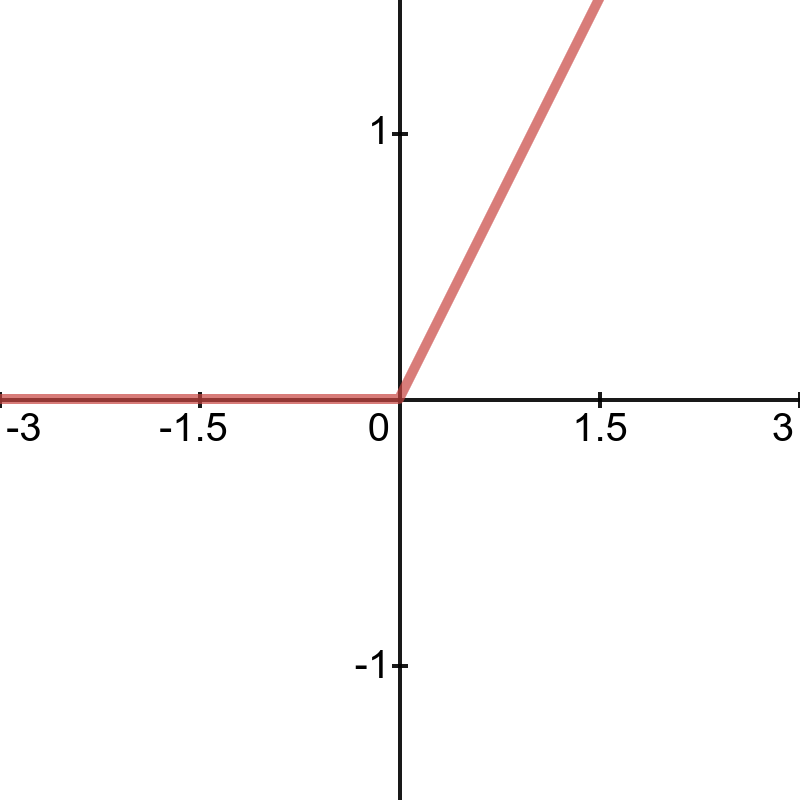
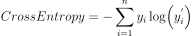

# NeuralNetwork-scratch
Building Neural Network from scratch using Numpy &amp; Python


## Neural Network

<p align="center">
  
</p>

## Setup 

```bash
git clone <url>
pip install -r requirements.txt
```

```bash
python p2.py
```

## Activation Functions

Activation functions live inside each neuron in the neural network layers and modify the data they receive before passing it to the next layer. Activation functions give neural networks their power  by  introducing non-linearity, allowing them to model complex relationships.

`X: input`

- Linear

  
  <br>
  
  
- Rectified Linear Units (ReLU)

  0 \end{cases}" />
  <br>
  
  
## Loss Functions

A loss function, or cost function, tells us “how good” the model is at making predictions for a given set of parameters. The slope of this curve tells us how to change our parameters to make the model more accurate. We use the cost function to update our parameters.

`y: actual value | y' / y^p: predicted value | n: number of samples`

  - CrossEntropy

  

## References 

(Neural Networks from Scratch book)[https://nnfs.io]
